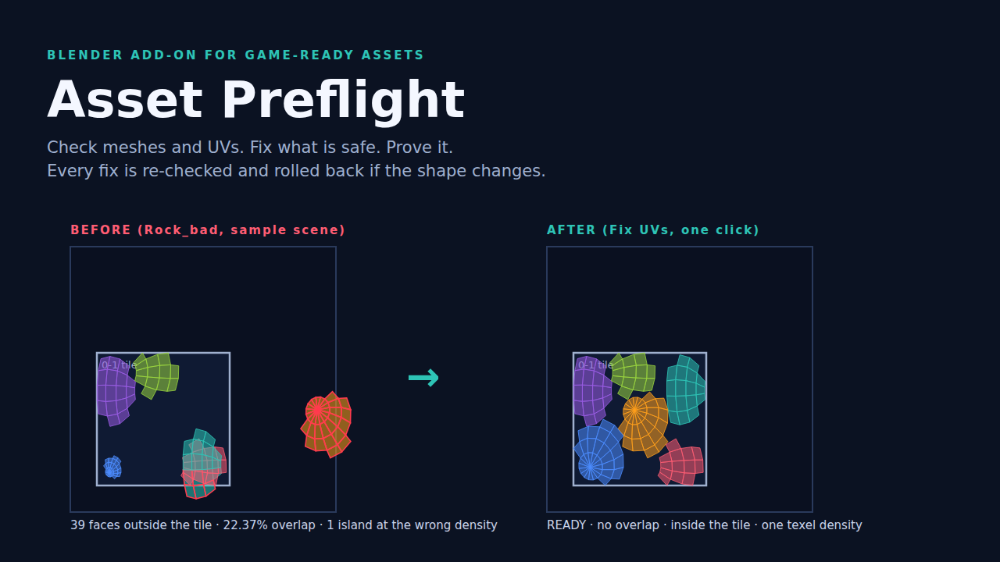

# Asset Preflight

A Blender add-on that checks meshes and UVs the way a game engine sees them, fixes what is safe to fix, and **proves** it: every fix is re-checked, and an object is rolled back if a fix ever changes its shape.

**Get it:** https://croucamp.gumroad.com/l/asset-preflight ($19, 30-day refund, includes a guide and a sample scene)

## Checks
- **Errors:** scale not applied (or negative), flipped normals, no UV map.
- **Warnings:** UVs outside the 0-1 tile, overlapping UV islands, uneven texel density between islands (pixels per metre), loose geometry, duplicate vertices, zero-area faces, n-gons, triangle budget, empty material slots.
- **Info:** stretched UV faces, unused slots, open edges, several UV maps, unapplied modifiers.

## Fixes (each verified)
Apply scale (with safe handling of negative scale and shared meshes), clean geometry, remove empty material slots, and repack UVs at one texel density. After each fix the bounding box and surface area are compared with before; if they differ the object is rolled back.

## Measured
- 23 automated tests plus a buyer-path test of the download, on **Blender 4.2.9 LTS and 5.1.2**.
- Sample scene: 2 flawed assets + 1 clean; the whole scene goes READY in two clicks with every shape unchanged.

## Honest limits
UV overlap is a 512 x 512 raster estimate. The UV fixer repacks the layout (mirrored/overlapping-on-purpose UVs get separated). No export presets, texture/rig/animation/LOD checks, and not tested inside any game engine. Tested on Linux; Windows and macOS untested (hence the 30-day refund). Blender 4.2 LTS or newer, GPL-3.0-or-later.

Developer: Hanru Croucamp
